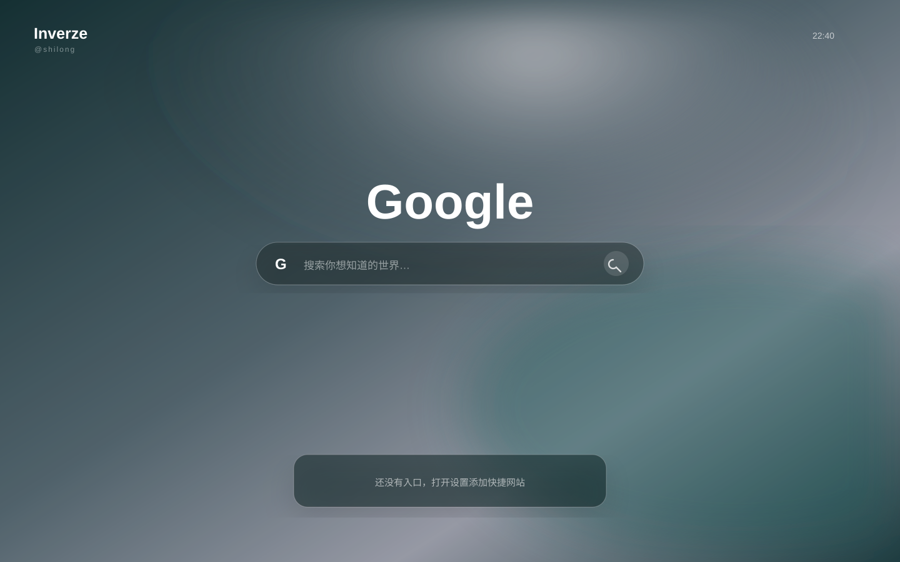

  

A minimal glass new-tab experience for Chrome.

  

# Inverze

Inverze 是一个轻量、无后台服务、可自定义的 Chrome 新标签页扩展。作者：shilong。

## 特性

- 磨砂玻璃背景，可上传图片并在设置中调节 0–32px 模糊强度
- 经典 Google 标题与 Google / Bing 搜索切换
- Dock 根据入口数量自动调整宽度，最多支持 12 个网址
- 自动读取网站官方 favicon，并统一转换为无彩色高对比图标
- 支持添加、删除、编辑和拖动排序快捷入口
- 入口数据和背景图只保存在本地 Chrome 存储中
- 首次运行不预置任何网址，仓库不包含作者的个人快捷入口

## 安装

1. 下载或克隆本仓库。
2. 打开 Chrome，访问 `chrome://extensions`。
3. 开启右上角“开发者模式”。
4. 点击“加载已解压的扩展程序”。
5. 选择本项目根目录。
6. 新建标签页即可使用。

## 使用

点击右上角设置按钮，可以：

- 上传或恢复背景
- 调节磨玻璃强度
- 添加、编辑、删除快捷入口
- 拖动快捷入口调整顺序

搜索框左侧可以在 Google 和 Bing 之间切换。上传的背景图会在浏览器本地自动压缩后保存，不会上传到本项目或第三方服务器。

## 项目结构

- `manifest.json`：Chrome Manifest V3 配置
- `newtab.html`：新标签页结构与设置面板
- `styles.css`：磨砂玻璃、搜索框和 Dock 样式
- `app.js`：搜索、存储、背景处理和快捷入口逻辑
- `assets/`：项目 logo 与首页效果预览

## 隐私

本项目不包含账号、邮箱、密码、Token 或个人网址。快捷入口、背景图和设置只写入当前浏览器的 `chrome.storage.local`。搜索提交后会按用户选择跳转到 Google 或 Bing。

## License

MIT © 2026 shilong
